## 1.1 神经系统基础
神经解剖学 (neuroanatomy)中，一般常用三个轴和三个平面来在脑(brain)和脊髓(spinal cord)中描述空间位置。
轴 (axis): 
- rostral-caudal 前侧/喙侧-后侧/尾侧
- dorsal-ventral 背侧-腹侧
- medial-lateral 内侧-外侧
平面 (plain):
- Horizontal plane 横截面 (水平面)
- Coronal plane 冠状面
- Sagittal plane 矢状面

**上行/传入 (afferent)** 与**下行/传输 (efferent)** 指的是周围神经
desec
##### 中枢神经系统的七个主要部分
- **脊髓 (spinal cord)**，中枢神经系统的最尾部，负责接收与处理四肢 (limbs)和躯干 (trunk)的信息并控制其运动。包括颈椎 (cervical)、胸椎 (thoracic)、腰椎 (lumbar)、尾椎 (sacral)
脊髓向前延伸的结构称为**脑干 (brain stem)**，包括间脑、脑桥与中脑三个部分。脑干的功能包括：接收头部皮肤与肌肉传感器并为头部肌肉提供运动控制、在脑与脊髓之间传递信号、通过网状结构 (reticular formation)调控觉醒 (arousal)与意识 (awareness)水平。脑干包括多个细胞集合，即脑神经核 (cranial nerve nuclei)
- **间脑 (medulla oblongata)**，后接脊髓，负责重要的自主功能 (autonomic functions)，包括消化、呼吸、心率控制等。
- **脑桥 (pons)**，后接间脑，从大脑半球向小脑传递运动信息。
- **中脑 (midbrain)**，后接脑桥，控制众多传感器和运动功能，包括眼部运动、视觉和听觉的协调。
- **小脑 (cerebellum)**，位于脑桥的后侧，调控运动的力量和范围，与脑干有功能上的联系。
- **间脑 (diencephalon)**，后接中脑，包括两个结构。**丘脑 (Thalamus)** 负责处理绝大部分传递至大脑皮层的信号，**下丘脑 (hypothalamus)** 负责调控自主 (autonomic)、内分泌 (endocrine)和内脏 (visceral)功能。
- **大脑 (Cerebrum)** 包括两个**脑半球 (cerebral hemispheres)**，其中每个都包含有很多褶皱的大脑皮层/皮质和皮层下/皮质下结构。大脑的两个半球分别接收与控制对侧躯干与肢体，且不是完全对称的。

>1. 此段出现了两个和运动有关的单词: motor 与 movement，前者侧重于运动产生相关的机制或系统/结构 (如motor neuron)/信号，后者则侧重可观测的运动结果，如movement disorder、movement trajectory
>2. autonomic function指的是自主功能，对应的是不受意志支配的自主神经系统 (autonomic nervious system, ANS)，控制心肌、平滑肌、腺体等

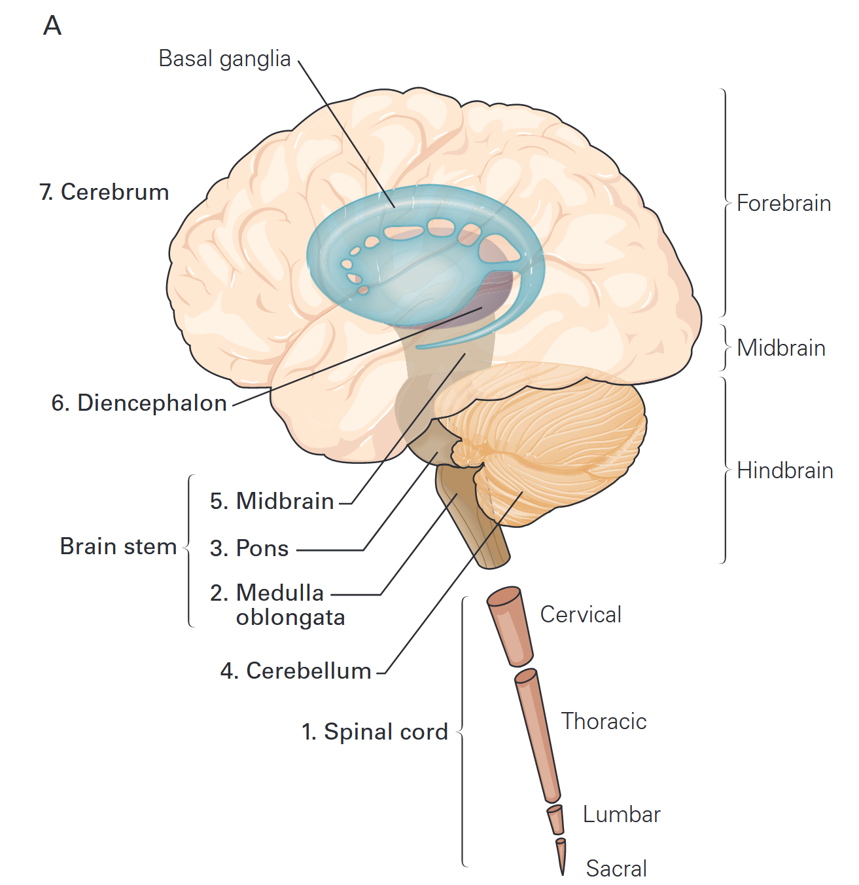
##### 大脑的结构
脑组织根据解剖学的观察和组织学分析，可以分为两个典型的成分：
- **灰质 (gray matter)**，主要成分为神经元的胞体和树突，因此呈现颜色较灰，负责信息处理与运算。
- **白质 (white matter)**，主要成分为髓鞘包裹的神经元轴突，因此颜色较白，主要负责在灰质间传递信息。
灰质可以分为**皮层/皮质 (cortex)** 和**核团 (nucleus)** 两类组织，其代表了不同的组织形态，其中皮层由内向外有多个层级，而核团则一般分布分布在大脑的深处。
皮层并非一种单一的结构，而是根据系统发育形成的时间早晚分为四类皮层，即3个细胞层的古皮层 (archicortex)、3~5个细胞层的旧皮质 (paleocortex)、3~6个细胞层的中间皮质 (mesocortex)、6个细胞层的新皮质 (isocortex/neocortex)，在大脑中形成了不同的结构。
处于大脑外侧的皮层由新皮质构成，约占皮质的70%以上，可以分为四个叶：
- **前额叶 (frontal lobe)** 与短时记忆、动作规划、高等认知功能有关
- **顶叶 (parietal lobe)** 与躯体感觉有关
- **枕叶 (occipital lobe)** 与视觉有关，其接收视觉信息再通过dorsal/ventral stream传输给顶叶与颞叶
- **颞叶 (temporal lobe)** 处理听觉信息，物体认知
向内一层的结构则由中间皮质构成，主要有两个结构
- **扣带皮层 (cingulate cortex, CC)** 位于胼胝体的背侧，参与情感、疼痛感知、认知调控。
- **岛叶 (insular)** 位于前额/顶/颞叶的深处，参与情感、体内平衡与味觉感知
旧皮层
古皮层仅构成了一个结构，即海马体
- **海马体 (hippocampus)** 负责**显性记忆/陈述性记忆 (explicit memory)**，即对事件、人、环境的记忆。
灰质核团构成了重要的基底核/基底神经节，也是丘脑中丘脑核的组成部分
- **基底神经节/基底核 (basal ganglia)** 包括了尾状核 (caudate nucleus)、壳核 (putaman)与苍白球 (globus pallidus)，负责两种记忆方式中的**隐性记忆/非陈述性记忆 (implicit memory)**，即调控运动执行 (movement excecution)、运动学习 (motor-learning)与习惯学习。
- **杏仁核 (amygdaloid nuclei)** 负责对情感状态的自主神经与内分泌反应，包括对威胁的记忆，也属于隐性记忆的一种。
>以上叙述，是从系统发育与组织学上梳理大脑灰质的分类。而一般意义上，还会将扣带回、海马等非新皮层系统统称为**边缘叶**，与岛叶、丘脑、下丘脑等结构合称**边缘系统 (limbic system)**

白质中一个重要结构称为**胼胝体 (corpus callosum)**，是连接两个脑半球的纤维束。

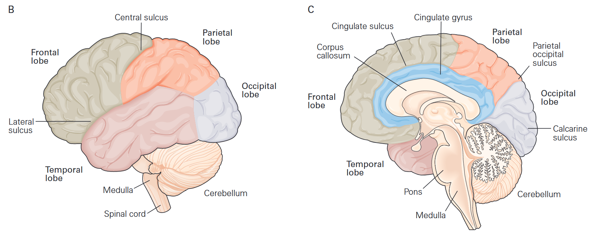
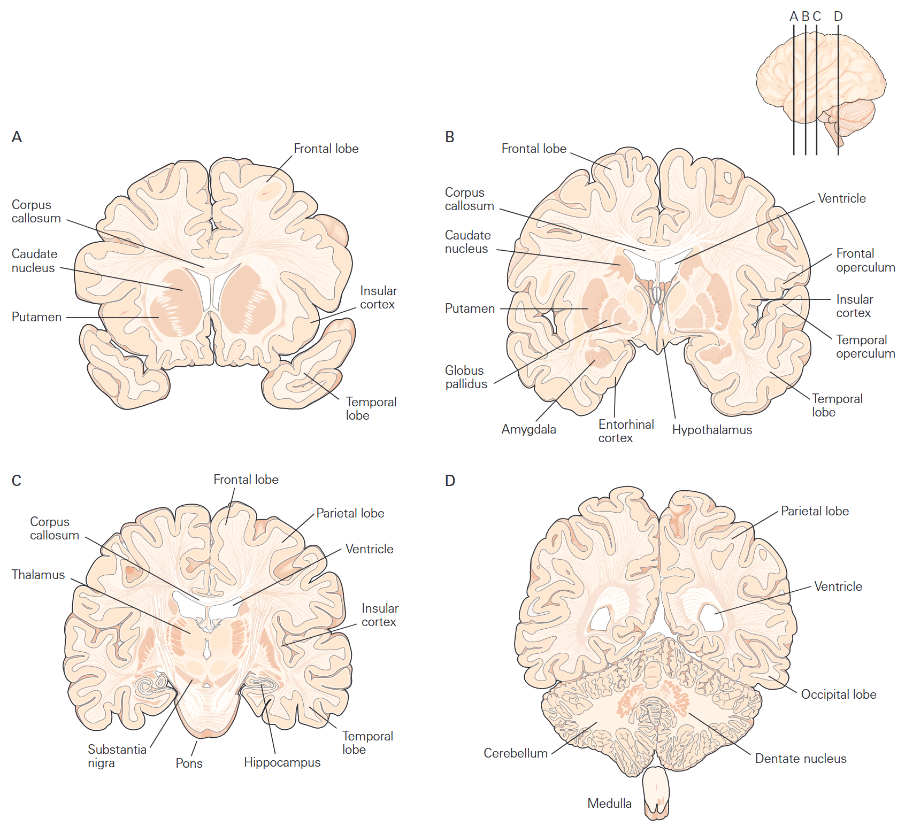
## 1.2 基因对行为的影响
Seymour Benzer于1970左右开始研究单个基因对行为的影响，使用果蝇突变体研究包括昼夜节律、运动、视觉、社交等行为
##### 昼夜节律的分子振荡机制
经过Benzer组的大量筛选，*period*, *per* 基因被认为与果蝇的节律相关，*per*完全失活突变不表现出具有节律的特征，即Arrythmic mutant；而*per*部分失活则有可能会表现为短昼夜节律或长昼夜节律。
*per*表达会产生一种转录因子PER，其水平会在一天中受到调控。早上的PER和其mRNA量都很低，但它们的量会随着时间积累，在傍晚直到晚上达到最高，再在晚上时降低。

在大量筛选昼夜活动周期异常的小鼠后，Takahashi组发现了一个基因并命名为*clock*，当clock纯合小鼠被放进黑暗中时，他们会首先经历一段极端的长昼夜节律，随后就会丧失昼夜节律。

clock和per都有一个PAS结构域 (一类转录因子的特征结构域)，说明果蝇和mice昼夜节律的调节机制都与PAS结构域转录因子的振荡相关

所以24小时的循环主要的原因是PER蛋白的积累和激活在转录后被多种因素延迟，如PER磷酸化、稳定性和其与多种周期性蛋白的互作

**Key**
- 昼夜节律基因的转录水平在24小时动态变化，PER活性夜晚高，而CLOCK白天高，昼夜节律基因表达的PER与CLOCK都是转录因子，其中CLOCK会刺激per基因的转录，但转录产生的PER蛋白则会抑制CLOCK的活性，所以当PER蛋白积累时，per的转录会变少。
- 昼夜节律基因同时也会调控其他多种下游基因的表达

- 首先从夜晚的*per*和*tim*开始转录说起，此时PER和TIM含量低，这两个基因转录并在胞质中合成，虽然PER蛋白单独存在下不稳定，但是TIM蛋白与其结合为稳定地PER/TIM复合物，随着复合物的积累、PER/TIM蛋白进入核中抑制per和tim的转录，使得时间越晚其转录速度越来越慢。
- 在第二天天亮时，光会激活隐花色素cryptochrome，并作用于TIM蛋白使其降解，进而PER蛋白没有了TIM的保护后，经过至少两步的磷酸化也会被降解
- 这些基因的周期性都可以被光重置
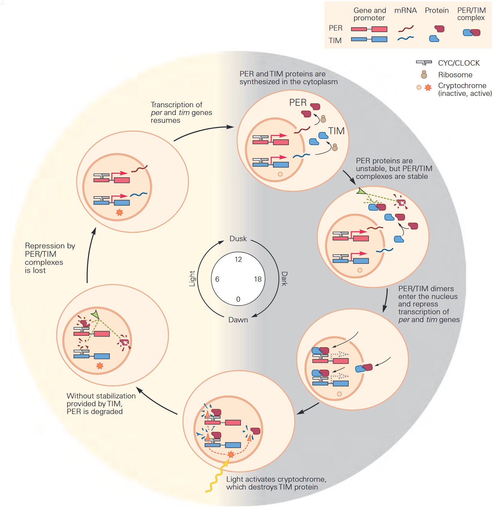
##### *for*基因的两种调控模式
在突变这种大幅度的人为干预之外，我们也需要考虑在正常个体之中，遗传信息的变化(change)是否会导致行为的变化，这种多态性是更subtle的问题

Sololowski团队发现果蝇的幼虫 (Larvae)在活动性之间有差异，活动力更强的称为rovers，更弱更静止的被称为sitters，且这种特质是会遗传的。分析发现一个主要区别在于*for* (forager) locus，其编码了一个信号转导酶，本质上是一个会被cGMP激活的蛋白激酶，所以这个行为上的差异来源于信号转导通路的调控。

蜂蜜中的*for*基因控制了其他不同的行为，年幼的蜜蜂一般是育雏蜂 (nurses)，而年长的蜜蜂则外出觅食 (foragers)。for基因被发现在foragers中高表达，而较为静止的nurses中低表达，激活年轻蜜蜂中的cGMP的信号通路会使得其提早成为foragers。

**Key**
- **蛋白激酶等一些分子在短暂的神经信号转化为神经/环路级别的长期改变中起到了尤其重要的作用**
- **关键的调控机制可以在不同的物种中被用于不同的行为策略** (果蝇中不同个体差异，蜜蜂中相同个体的不同发育阶段差异)
##### 神经肽受体调控社会行为
线虫 (*Caenorhabditis elegans*)中有两种显著不同的摄食行为 (摄食行为)，其中一种在皿中分散并不与其他个体接触 (solitary)，而另一种则会加入数百线虫组成的觅食群 (social)。这两种行为模式是稳定遗传的，区别来源于一个基因 (*npr-1*)中单碱基的差异。

*npr-1*编码神经肽受体，影响神经元之间的信息交流，在哺乳动物中也影响社会行为。如催产素 (oxytocin)与血管升压素 (vasopressin)会促进哺乳动物的亲社会行为 (affiliative behaviors)，包括pair bonding和 parental bonding。

pair-bonding在不同的物种中也不甚相同，雄性草原田鼠 (prairie voles)会与雌性形成长期的关系并养育后代，形成一夫一妻关系 (monogamous)，而雄性山地田鼠 (montane voles)则不会形成长期关系并养育后代。这样的差异与脑中V1a class vasopressin受体表达相关，前者在苍白球腹侧(ventral pallidum, VP)区域高表达，而后者则在VP低表达，而在LS等区域高表达。

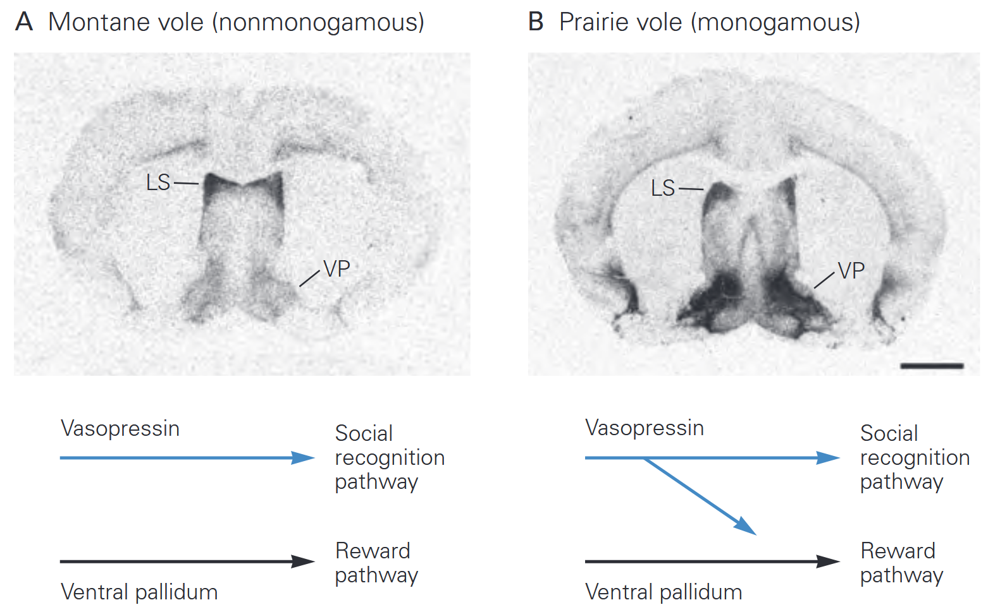
##### 基因与环境影响认知与行为

1934年，AsbØrn FØlling首次阐述了苯丙酮尿症 (Phenylketonuria, PKU)，其致病的代谢机制详见[[|链接]]。

对于神经发育罕见综合征研究最早来源于威廉姆斯综合征 (Williams syndrome, WS)，患儿在社交方面表现出极强的能力，并伴有其他生理表现，包括先天性心脏缺陷、发育迟缓等。对比自闭症谱系障碍(autism spectrum disorders, ASD)发现语言能力的脑区在前者中激活而后者中大幅削弱。WS的原因为7q11.23中包含27个基因1.5Mb长的片段缺失，导致相关基因表达量大幅下调。ASD患者新发 (*de novo*)的数量变异 (copy number variations, CNV)则远高于正常个体，且WS中的缺失会切实提高ASD的风险。

脆弱X染色体症候群 (Fragile X syndrome)的患者可表现智力障碍、社交障碍等症状。该疾病机制为X染色体上的fragile X mental retardation protein (FMRP)表达量降低，因此仅有一条X染色体的男性表现更重。FMRP调控神经元中mRNA的翻译，而这个过程也受到神经活动的影响，神经元中对于翻译的调控是突触可塑性 (synaptic plasticity)中的重要一环。

## 1.3 神经元与环路

> 几个关键的概念 (后文会详细提及)：
> 1. **连接 (connection)** 可以指任何结构上和功能上的联系。
> 2. **通路 (pathway)** 强调的是一条路径，可以指的是神经电信号的传播路径，也可以指胞内分子水平的信号，需要具体注明。
> 3. **投射 (projection)** 强调的是一个区域向另一个区域的信号传递，如脊髓向皮层的投射等
> 4. **环路/回路 (circuit)** 
> 5. **网络 (network)** 
##### 神经系统中的两类细胞——神经元与胶质细胞
神经细胞(nerve cells)/神经元 (neurons)主要包括四个区域：
- **细胞体 (Cell body, soma)** 包括细胞核/内质网等细胞器，功能包括储存遗传信息、合成蛋白质、作为代谢中心等，表面有两种**突起 (process)**
- **树突 (dendrite)** 较短且数量多，从细胞体向外树状发散，主要负责从其他神经细胞接收信号。
- 单一的管状**轴突 (axon)** 从细胞体向外延伸一定距离，并将信号传递给一个或多个靶神经细胞，可以传输电信号远至1m。
- 突触前末梢 (presynaptic terminals)

神经元中的电信号称为**动作电位 (action potential, AP)** ，在轴突靠近细胞体的**轴突起始节 (axon initial segment, AIS)** 中生成，并沿着轴突维持100mV电压无损传播。动作电位在各种不同的信息引起的神经活动中都保持高度的一致性，因而大脑分析动作电位的信号时，依赖的是该信号传输至大脑的通路，而非信号本身的形式。

为了提高电信号传输速度，长的轴突会被一层绝缘的脂质鞘包裹，即**髓鞘 (myelin)**。而髓鞘并不是从头到尾的连续包裹，在其中一些位置会有暴露未绝缘的节点，被称为**郎飞结/兰氏结 (Nodes of Ranvier)**。

轴突到了末端可能会被分开并与多个其他细胞相连，连接的特殊结构称为**突触 (synapse)** ，发送信号的轴突末端会形成一个膨大的部分，称为**突触前末梢 (presynaptic/nerve terminals)** 或**突触小结/小体 (synaptic bouton)**，经过一段狭窄的**突触间隙 (synaptic cleft)** 与突触后相连，突触后一般为树突，但也存在部分情况是细胞体甚至轴突。

**基于形态学的神经元分类**
- **单极神经元 (Unipolar neurons)** 结构最简单，在细胞体上只有一个突起，该突起再分叉形成一个轴突与数个树突，是无脊椎动物中的主要神经元。而在脊椎动物中则主要存在于自主神经系统。
- **双极神经元 (Bipolar neurons)** 含有一个椭圆的细胞体，两边分别为一个树突和一个轴突。许多感受器为双极神经元，如视网膜和鼻嗅上皮。而将感觉信息传入脊髓的另一种神经元最初被认为是双极细胞，实际上它的两个突起已经融合，并从细胞体的单一位置伸出，因此被称为**假单极神经元 (pseudo-unipolar neuron)**。
- **多极神经元 (Multipolar neurons)** 是脊椎动物神经元的主要形态，由细胞体伸出一条轴突与多条树突，不同神经元的轴突与树突分叉的数量与形态差别巨大，如脊髓运动神经元树突可以形成约10000个接触，小脑中的浦肯野细胞 (Purkinje cells)可以形成百万个

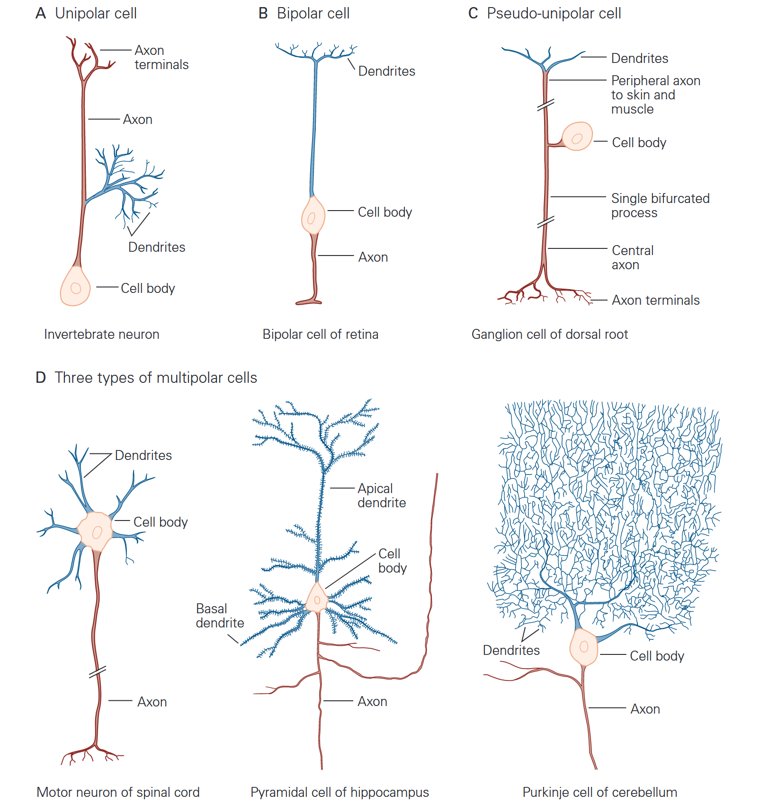

**基于功能的形态学分类**
- **感觉神经元 (sensor neurons)** 从外周感受器向神经系统传递信息，

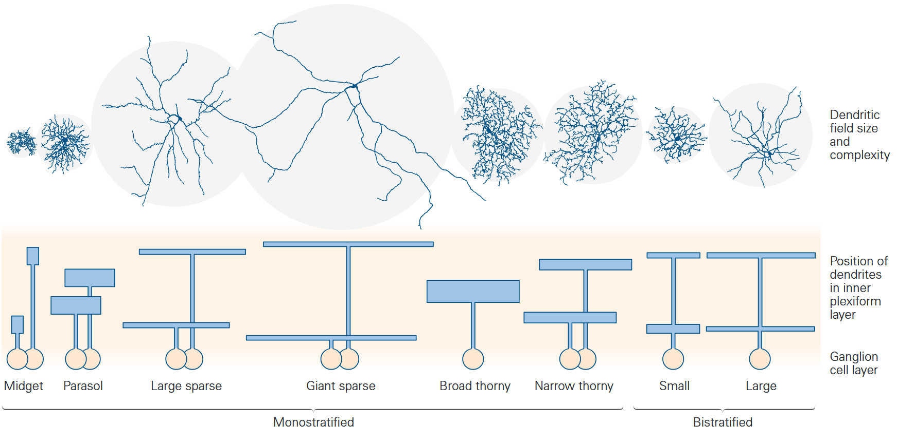
- **运动神经元 (motor neurons)** 

> 与感觉/运动神经元 (sensor/motor neurons)相对的另一对概念称为传入/传出神经元 (afferent/efferent neurons)，与具体传入感觉及传出。afferent指的是向中枢神经系统传输各种信息的过程 (不一定会产生感觉)，而sensory则特指向中枢神经系统传递的感觉上皮、关节或肌肉的信息，但目前该概念已经扩展至初级皮层和次级皮层中的神经元

- **联络神经元 (interneurons)** 包括最多数量的功能分类，根据传输距离主要可划分为两种，其中**投射神经元 (projection neuron)** 有很长的轴突并可以在不同脑区间远距离远距离传输信号，而**局部神经元 (local neuron)** 的轴突较短并连接附近的神经元构成局部环路 (local circuit)。

> 实际研究中存在两种常见但不准确的说法，第一种是将 interneurons 特指了局部神经元，对应投射神经元。第二种是用其特指抑制神经元，主要出现在皮层环路的研究中，需要加以辨别。

**胶质细胞**
在脊椎动物中枢神经系统中，**胶质细胞 (Glial cells, Glia)** 数量大约为神经元的2~10倍，它们会包围神经元并提供保护作用，也可以促进神经元中电信号的快速传播，同时可能在学习过程中促进神经元间形成新的连接。
##### 神经环路
以经典的**膝跳反射 (knee-jerk reflex)** 为例，该反射触发于身体短暂失衡导致的股四头肌 (quadriceps femoris) 拉伸，该感觉信息会传输至运动神经元，处理后再传输至股四头肌使其收缩来恢复身体平衡。该机制可以保持我们股四头肌的正常张力，并使得我们在正常行动是膝盖不会弯曲。股四头肌肌腱 (tendon) 通过髌骨 (patella) 连接至胫骨 (tibia)，来帮助我们移动小腿。而轻敲髌骨下方的肌腱则可以刺激股四头肌收缩，引发膝跳反射，因此这种方法可以测试神经的完整性以及脑-脊髓 (celebrospinal)对反射幅度的控制。

膝跳反射的感受神经元的胞体位于脊髓附近的**背根神经节 (dorsal root ganglia, DRG)**，属于假单极神经元。该神经元一根伸入股四头肌边缘连接**牵张感受器 (strech receptors)**/**肌梭 (muscle spindles)**。其轴突伸入脊髓中，与支配股四头肌的运动神经元连接形成兴奋性连接，同时与一个抑制性局部神经元连接，该神经元会使得控制腘绳肌 （对抗股四头肌的伸肌）的运动神经元被抑制，从而协同完成功能。除了以上三个信息的传递，该膝跳反射的局部神经活动也会向更高级的神经中枢传递，从而使得脑也可以协同控制这些行为。

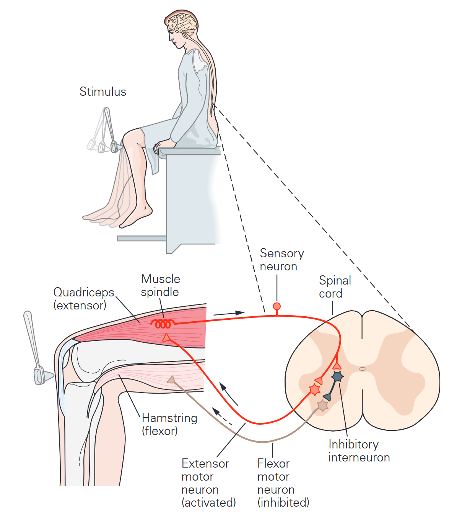

**发散与聚合**
在膝跳反射中，每个感受神经元会与45-50个运动神经元相连，这种模式称为**发散 (Divergence)**，常见于神经信号的传入时，这可以使一个神经元产生大量且多样的影响。而与之相对的模式则称为**聚合(Convergence)**，例如每个运动神经元都会从200-450个感受神经元中接收信号，这种模式则主要出现于神经信号的输出中。这样的优点在于每个输入的感受神经元可以输出相对较低的兴奋水平，使运动神经元只有接收足够多感受神经元的刺激才会被激活。

**前馈与反馈**
膝跳反射中一个感受神经元同时刺激兴奋神经元与抑制神经元，并分别促进及防止对应肌肉收缩的方式被称为**前馈抑制 (Feedforward inhibition)**，这种方式使得控制伸肌和屈肌的通路是相互抑制的，不会同时收缩以至无法完成行动。另一种方式则称为**反馈抑制 (Feedback inhibition)**，即一个运动神经元刺激肌肉和一个抑制神经元，而该抑制神经元会反过来抑制该运动神经元。

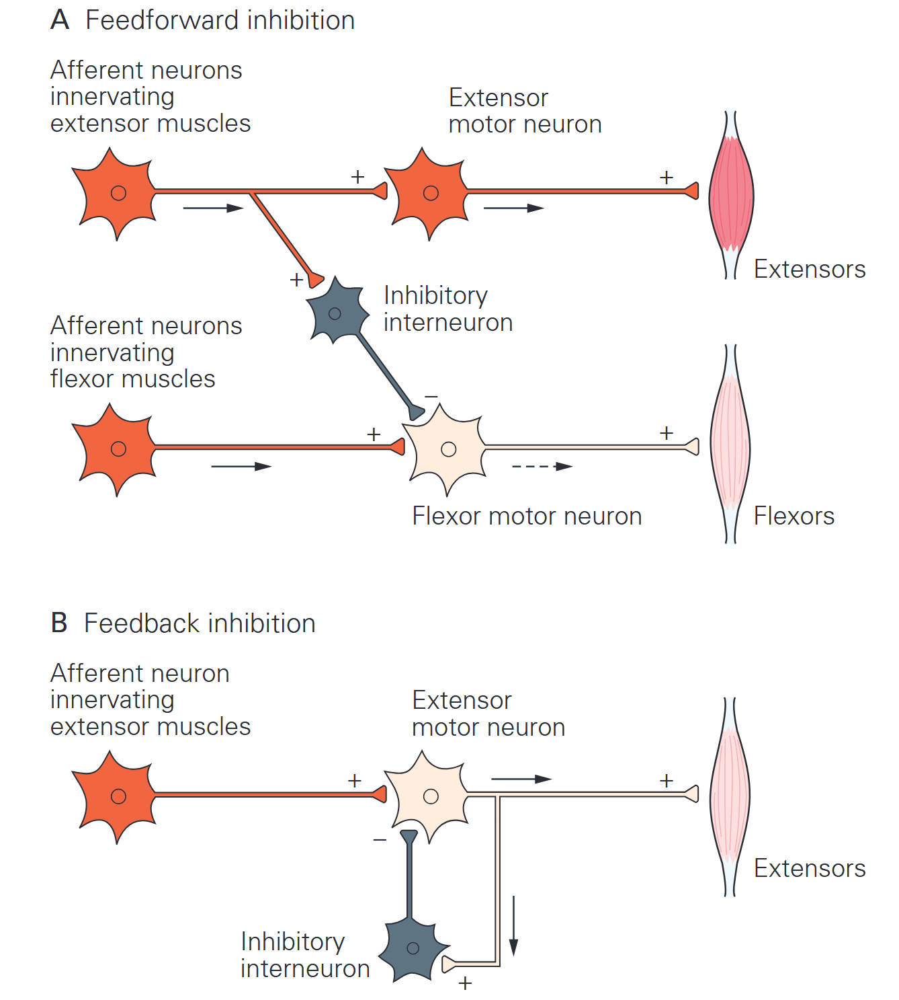
##### 神经元中的电位
大部分细胞会维持一个特定的电位，称为**静息电位 (resting membrane potential)**，典型的神经元内电压约为 -65 mV (相比胞外)，不同神经元静息电位的范围约 -40 至 -80 mV，肌肉细胞则可达到约 -90 mV，胞内外电压的不平衡主要来源于带电离子的分布不均 ($Na^+$与$K^+$)。静息状态下，胞内离子水平主要由**钠钾泵($Na^+-K^+$ pump)** 维持，其持续向胞外泵出钠离子的同时向胞内泵入钾离子，使得胞内$Na^+$浓度低而$K^+$浓度高。胞外的离子水平则由肾脏与**星形胶质细胞 (astroglial cells, astrocytes)** 维持。除钠钾泵外，离子通道也可以允许$Na^+$与$K^+$进出细胞。当细胞静息时，这些离子通道对$K^+$开放而对$Na^+$不开放，因此$K^+$会持续渗漏出细胞，使得细胞膜内外的电荷是不平衡的，细胞内膜带负电荷，在离子的流动平衡后测量即得到了 -65 mV 的电位。

**动作电位 (AP)**
当$Na^+$或$Ca^{2+}$粒子大量内流并中和细胞内膜的负电荷时，静息状态就会被打破。大部分神经元中，10 mV (-65 至 -55)的变化就会让电压依赖的离子通道对$Na^+$的通透性大幅增强，从而使得$Na^+$内流更加剧烈。这样的正反馈会使得细胞内电位跃升至 +40 mV，该电位也称为**动作电位 (action potential, AP)**，其性质是**全或无的 (all or none)**，即拥有相同的+40mV的**幅度 (amplitude)** 和约0.1ms的**持续时间 (duration)**，并可以远距离保真地传输至轴突末端。

**感受器电位**
在膝跳反射中，肌肉收缩引起了感受神经元中特定的离子通道，引发$Na^+$离子内流，并改变了膜电位，这种**局部**的信号称为**感受器电位 (receptor potential)**。感受器电位的性质是**分级 (graded)** 的，拥有其特定的幅度与持续时间，一般由刺激的强度与持续时间决定。大部分感受器电位都为去极化 (兴奋)，而视网膜则为超极化 (抑制)。

不同于动作电位，感受器电位的传播方式为被动传播，即电位幅度会随着传播衰减 (decay)，因此传播距离是极其有限的（一般 1 mm），因此把这种局部信号放大转换为动作电位是十分必要的。在膝跳反射中，如果感受器电位的强度足以使其传播至第一个郎飞结处，那么其就会触发动作电位，并保真的传输至与运动神经元交界的突触处引发其信号

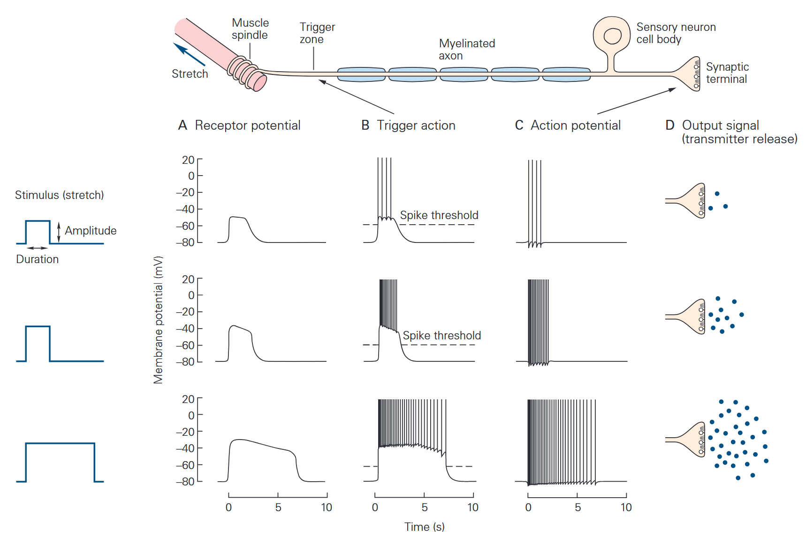

**突触电位**
当动作电位传递至突触前末梢时，其会释放**神经递质 (neurotransmitter)** 进入突触间隙，当神经递质扩散至运动神经元突触后膜上的受体蛋白时，就会引发运动神经元膜电位的改变。这种膜电位称为**突触电位 (synaptic potential)**，其性质同样也是**分级 (graded)** 的，初始电位的幅度由神经递质的量决定，并随着传播削减。同样，突触电位的被动传播也是局部信号 (有部分树突是例外)，如果该信号能到达轴突起始节 AIS 的话，则会转换为动作电位。部分细胞根据其突触后膜上被结合的受体类型，可选择性的产生去极化或超极化的电位。

**感受器/突触电位引发AP**
感受器/突触电位的输入信号会产生局部的去极化，从而使得局部的钠离子通道开放，引起$Na^+$离子内流。AIS内有极高密度的**电压门控钠离子通道 (voltage-sensitive $Na^+$ channels, Nav)**，因此拥有最低的阈值，所以如果此时输入信号的强度达到了阈值，则会引发大量Nav开放并介导剧烈的$Na^+$离子内流。

**动作电位的传输与特征**
如上所述，在不同的细胞和物种中，动作电位都具有高度的特异性。当AP信号在轴突上传播时，每个郎飞结都会重新产生动作电位，因此AP的幅度与持续时间随着传播也几乎不会衰减，其可以以100 m/s 的速度传播远至 1 m。由于AP自身几乎相同，信号的强度则取决于其数量和脉冲间隔 (频率)这两个特征。这两个特征是神经元不同放电模式的基础，部分神经元会在没有刺激的情况下自发地规律放电，部分会在短时间内爆发式高频放电。兴奋性感受器电位可能会在前者中引发一个或多个AP，而在后者中则引发放电频率的增加。**在自发放电的神经元中，抑制性输入对其放电模式有着明显的塑造作用**。

**神经递质**
到达神经元末梢的AP会刺激神经递质的释放以向突触后膜继续传递信号，神经递质可以是小分子或肽，被储存于轴突末端的**突触小泡 (synaptic vesicle)** 中，当感受到AP时与突触前膜融合，通过胞吐作用进入突触间隙，并扩散至突触后膜与受体结合。如上所述，这种突触信号也是分级的，其强度决定于释放的神经递质的数量，而兴奋性抑或抑制性则决定于突触后膜的受体类型（而非递质类型）

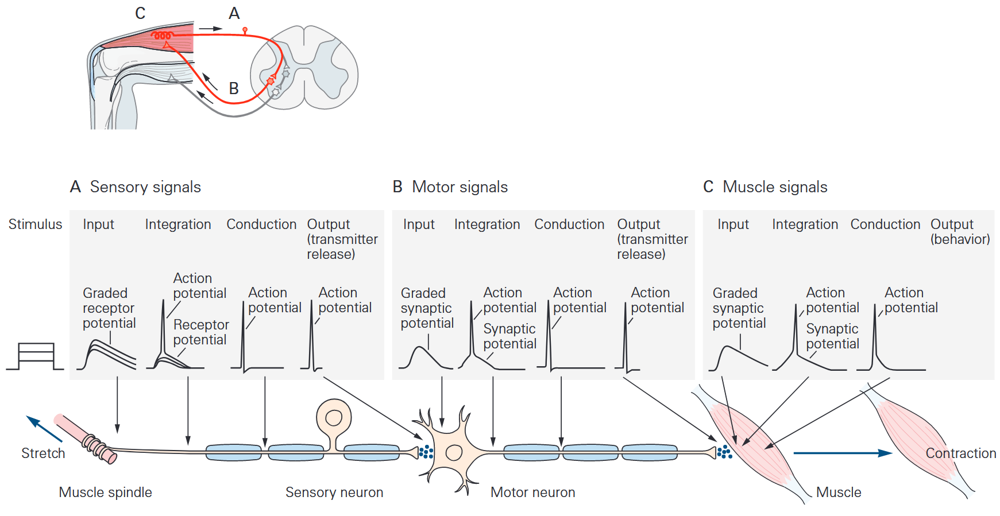
## 1.4 神经系统解剖
#### 脊髓
典型的脊髓横截面为白质区包裹着一个H形状的灰质区
- 灰质
	- **后角 (dorsal horn)** 包含了二级感受神经元，其树突从皮肤肌肉等处的初级感觉神经元接收刺激信号。
	- **前角 (ventral horn)** 包括运动神经元，其轴突伸出脊髓并控制肌肉。
- 白质
	- **背柱 (dorsal column)** 位于两个背角之间，仅存在上行的轴突，向脑干传输本体感觉信息。
	- **侧柱 (lateral column)** 包括上下行的轴突，连接脑干/新皮质和脊髓联络神经元和运动神经元
	- **腹柱 (ventral column)** 包括上下行轴突，下行控制轴向肌 (axial posture)及姿态

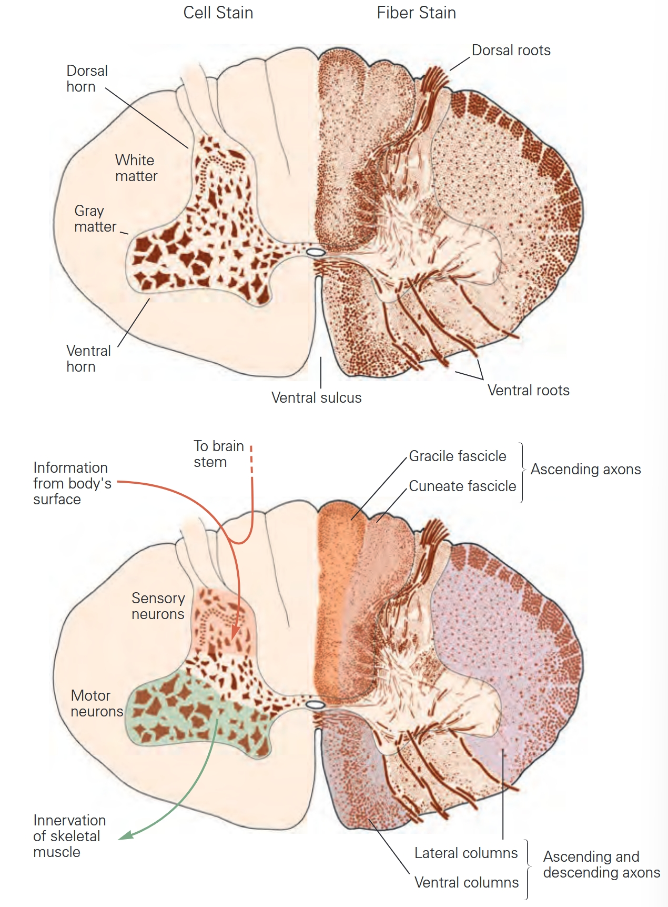

脊髓和其他身体结构相连的神经元轴突会合并在一个个**椎间孔 (intervertebral foramen)** 中通过，并形成**脊神经 (spinal nerves)**。共 31 对脊神经将脊髓划分为了不同的脊髓节段 (segment)，脊髓节段又可以组合为 4 个不同的区域:
- 颈髓 (cervical) 包括 C1 - C8 节段，控制头、颈与手臂
- 胸髓 (thoracic) 包括 T1 - T12 节段，控制躯干上部
- 腰髓 (lumbar) 包括 L1 - L5 节段，控制躯干下部与腿
- 骶髓 (sacral) 包括 S1 - S5 节段，控制躯干下部与腿

脊髓的形态从上至下是有一定变化的，这种变化主要取决于两个因素
- 进入脊髓的感觉神经元轴突数量向上不断增多，运动神经元则向下不断减少，因此颈髓包含最多的白质区，骶髓则包含最少的白质区。
- 运动神经元的数量和运动的灵巧程度 (dexterity) 有很强的相关性，因此控制手臂和腿的运动神经元则显著多余躯干处，而回传感觉的感觉神经元也是类似地，因此在颈髓下部与腰髓/骶髓区域就有一个明显扩大的灰质区，导致的整体增粗区称为**颈膨大 (cervial enlargement)** 与**腰骶膨大 (lumbosacral enlargement)**。

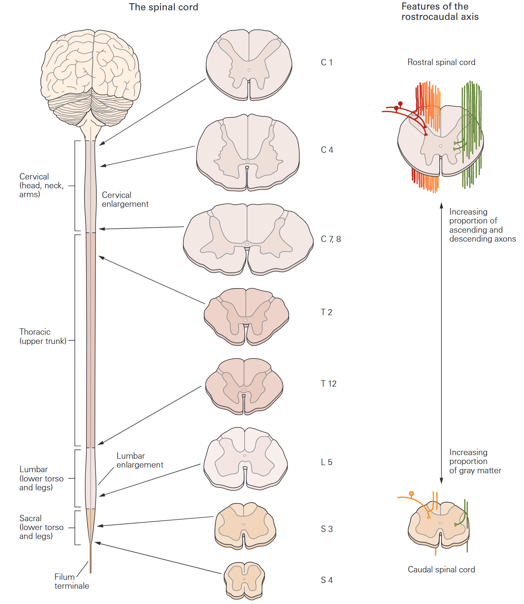

向脊髓中传递信息的感觉神经元在脊椎中会集合形成**背根神经节 (dorsal root ganglia)**，紧邻脊髓。这些感觉神经元为假单极神经元，其突起伸出胞体后会分叉形成**中央突 (central branch)** 与**外周突 (peripheral branch)**，前者经由背根伸入背角中，后者则伸入组织中形成**游离神经末梢 (free nerve end)** 或与特定感受器连接。进入脊髓的中央突上行时的位置时固定排列的，在骶髓进入的神经纤维靠近脊髓的中部，而在颈髓处进入的神经束则相对靠外。这些神经纤维在颈髓位置会分为两个束，靠中心的**薄束 (gracile fascicle)** 和靠外的**楔束 (cuneate fascicle)**，分别由下半身的神经纤维和上半身的神经纤维构成。

躯体感觉系统中包括两个系统，其包括的中央突上行路径不一：
- **protopathic system**:  感受痛觉与温度，主要通过**前外侧系统 (Anterolateral, AL) 系统** 传输。中央突到达脊髓后角灰质后连接第二级神经元，斜越到脊髓的对侧并通过**脊髓丘脑束 (Spinothalamic tract)** 上行至丘脑。
- **epicritic system**: 感受触觉或拉伸，主要通过**背柱-内侧丘脑束 (posterior/dorsal column–medial lemniscal system, DCML)系统** 传输，中央突自背根神经节进入脊髓，沿同侧 (ipsilateral) 的背柱上行到达延髓中的**薄束核 (gracile nucleus)** 或**楔束核 (cuneate nucleus)** 中连接第二级神经元，斜越到对侧再通过**内侧丘脑束 (medial lemniscal)** 上行至丘脑。

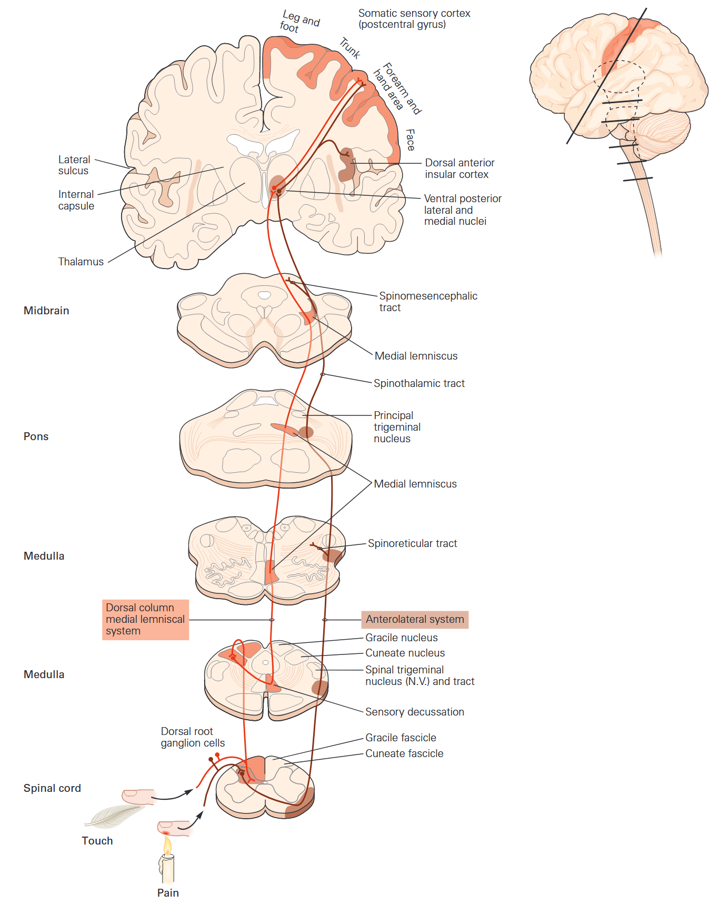

